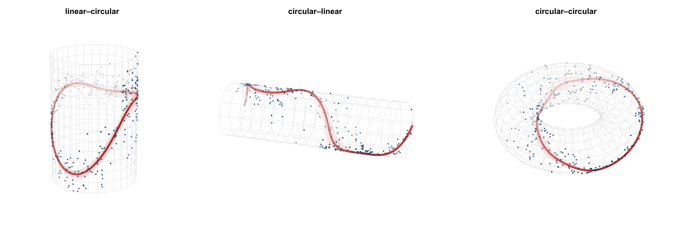

# circlss

`circlss` adds circular families that can be run with [mgcv](https://cran.r-project.org/package=mgcv)'s `gam`, enabling **Circ**ular Generalized Additive Models for **L**ocation, **S**cale and **S**hape.

<p align="center">

</p>

| type | response | covariate | geometry |
|---|---|---|---|
| **l~c** | linear | circular (`bs = "cc"`) | cylinder ("can") |
| **c~l** | circular | linear | cylinder |
| **c~c** | circular | circular (`bs = "cc"`) | torus |

## Install

```r
remotes::install_github("circstat/circlss") 
```

(`circlss` is not yet on CRAN. You can install it with `remotes` from Github for now. Requires `mgcv >= 1.9.4`.)

## Usage

`circlss` currently offers 12 circular families that can be plugged in to `mgcv::gam` directly for `c~l` and `c~c` regression. 

```r
library(mgcv);library(circular);library(circlss)
data(fisherB20c)

d <- data.frame(theta = as.numeric(fisherB20c$theta) * pi/180,  x = fisherB20c$x)
b1 <- gam(list(theta ~ s(x), ~ s(x, bs="ts")), 
          family = vmlss(), method = "REML", data = d)

plot(b1)
predict(b1, type = "response")
```

Those 12 families are:

  - von Mises `vmlss()`
  - projected normal `pnlss()`
  - wrapped Cauchy `wclss()`
  - wrapped normal `wnlss()`
  - cardioid `cardlss()`
  - Cartwright `cartlss()`
  - Jones–Pewsey `jplss()`
  - sine-skewed Jones–Pewsey `ssjplss()`
  - Kato–Jones `kjlss()`
  - flat-topped von Mises `vmftlss()`
  - inverse Batschelet `ibslss()`
  - asymmetric Jones–Pewsey `ajplss()`

For `c~c` regression, one needs to be careful about the knots position, as mgcv defaults to the range of the input data, but we normally want the whole range (`[0, 2*pi)` or `(-pi, pi]`, according to our data):

```r
library(mgcv);library(circular);library(circlss)
data(wind)

w <- as.numeric(wind)   # 310 daily directions, radians on [0, 2pi)
n <- length(w)
d <- data.frame(theta = w[-1], prev = w[-n])

b <- gam(list(theta ~ s(prev, bs="cc"), ~ s(prev, bs="cc")),
         family = vmlss(), method = "REML", data = d,
         knots = list(prev = c(0, 2 * pi)))
```

`circlss` offers `circ_gam()` as a thin wrapper over `mgcv::gam`, and supplies some sensible defaults: the cyclic-smooth period knots spanning (`[0, 2*pi)` or `(-pi, pi]`, infered from data) by default, a trailing `~ 1` fill (so you can model fewer parameters than the family has), `method = "REML"`, named response-scale output, and a geometry-aware `print` / `plot`, and forwards everything else straight to `mgcv::gam()`.

## Documentation

<https://circstat.github.io/circlss/>